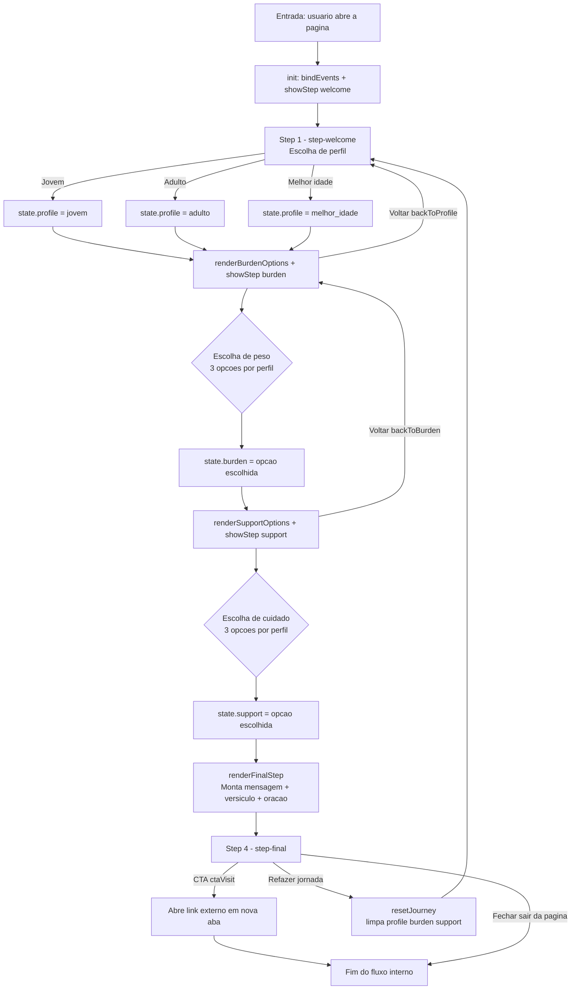

# Fluxograma da Jornada

```mermaid
flowchart TD
    A[Entrada: usuario abre a pagina] --> B[init: bindEvents + showStep welcome]
    B --> C[Step 1 - step-welcome<br/>Escolha de perfil]

    C -->|Jovem| C1[state.profile = jovem]
    C -->|Adulto| C2[state.profile = adulto]
    C -->|Melhor idade| C3[state.profile = melhor_idade]

    C1 --> D[renderBurdenOptions + showStep burden]
    C2 --> D
    C3 --> D

    D -->|Voltar backToProfile| C
    D --> E{Escolha de peso<br/>3 opcoes por perfil}

    E --> F[state.burden = opcao escolhida]
    F --> G[renderSupportOptions + showStep support]

    G -->|Voltar backToBurden| D
    G --> H{Escolha de cuidado<br/>3 opcoes por perfil}

    H --> I[state.support = opcao escolhida]
    I --> J[renderFinalStep<br/>Monta mensagem + versiculo + oracao]
    J --> K[Step 4 - step-final]

    K -->|CTA ctaVisit| L[Abre link externo em nova aba]
    K -->|Refazer jornada| M[resetJourney<br/>limpa profile burden support]
    M --> C

    L --> N[Fim do fluxo interno]
    K -->|Fechar sair da pagina| N
```

